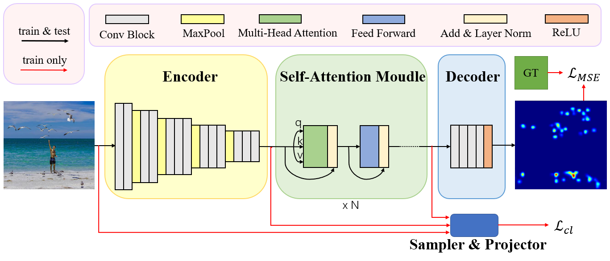

## Model

## result
|MAE/MSE|FSC-test|FSC-val|
|:-:|:-:|:-:|
|FamNet|22.08/99.54|23.75/69.07|
|VGG16Trans(**pretrain**)|17.51/132.62|19.21/77.43|
|VGG16Trans\*|18.10/133.24|20.92/81.77|
|ours|16.45/120.87|19.53/77.00|

[You can get the model here](https://drive.google.com/file/d/1ZhWMd2P1jVpua90L5QilBnqdWfF1s-g5/view?usp=sharing)
